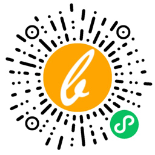

# BalmJS template - `vue-wechat-mp`

> A Vue.js project for WeChat Mini Program

## Demos



- 使用 Vue 开发微信小程序
- 默认内置 Weui 常用组件和微信 API
- 支持自定义小程序组件
  1. 小程序官方组件（需要时包装一下）
  2. 常用组件不够用时可自定义
  3. 第三方组件库（可以用，但没必要，除非你想搞“大程序”）

## Requirements

```sh
yarn global add balm-cli balm-core
# OR
npm install -g balm-cli balm-core
```

```sh
# Verify
balm -V

# Output:
# balm-cli: 3.0.0
# balm-core: 3.0.0
```

## Installation

```sh
balm init vue-wechat-mp my-project

cd my-project
yarn
# or
npm i
```

## Enjoy

```sh
# For web development
npm run web:dev

# For miniprogram development
npm run mp:dev

# For web & miniprogram development
npm run dev
```

> 使用微信开发者工具导入项目 `.mp`，之后便可以像开发 web 项目一样开发小程序

```sh
# For web & miniprogram production
npm run prod
```

> 使用微信开发者工具导入项目 `dist/mp`，之后便可预览构建好的小程序

- thx [BalmJS](https://github.com/balmjs/balm) & [kbone](https://github.com/Tencent/kbone)
